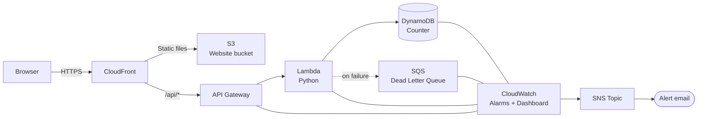

# Cloud Resume — Infrastructure as Code

A fully automated, production-grade AWS deployment of a static resume website with a serverless visitor counter. Built as a portfolio project.

Live: [fidele.samuth.com](https://fidele.samuth.com)

**Detailed documentation:**
- [Architecture](docs/architecture.md) — how each AWS service is used, explained for non-AWS readers
- [CI/CD pipeline](docs/cicd.md) — how code goes from a pull request to production
- [Security](docs/security.md) — security measures explained in plain terms
- [Runbooks](docs/runbooks.md) — step-by-step procedures for common operational problems

---

## Architecture



**Static hosting:** S3 bucket served via CloudFront with Origin Access Control. Security headers enforced at the edge (HSTS, CSP, COEP, X-Frame-Options). `Server` header stripped.

**Visitor counter:** API Gateway HTTP → Lambda (Python) → DynamoDB `UpdateItem` with atomic increment. Dead Letter Queue catches Lambda failures. AWS X-Ray distributed tracing enabled.

**Certificate:** ACM certificate in `us-east-1` (required by CloudFront), with DNS validation via Namecheap.

---

## Repository structure

```
.
├── terraform/
│   ├── bootstrap/          # One-time setup: S3 state backend, KMS key, OIDC, IAM role
│   ├── modules/
│   │   └── app/            # Reusable module: all application infrastructure
│   └── envs/
│       ├── staging/        # Staging environment (staging.fidele.samuth.com)
│       └── production/     # Production environment (fidele.samuth.com)
├── website/
│   ├── counter.py          # Lambda function
│   ├── tests/              # pytest + moto unit tests
│   └── public/             # Static website files
│       ├── index.html
│       ├── styles.css
│       ├── counter.js      # Calls the visitor counter API
│       ├── robots.txt
│       └── sitemap.xml
└── .github/
    └── workflows/
        ├── _deploy-env.yml   # Reusable workflow: plan / apply / sync for one environment
        ├── plan.yml          # PR checks: lint, test, plan, cost estimate
        ├── deploy.yml        # Main deploy pipeline (staging → ZAP → production)
        ├── drift.yml         # Daily drift detection on production
        └── security.yml      # Weekly ZAP passive security scan
```

---

## CI/CD pipeline

### On pull request — `plan.yml`

```
pytest tests  ──► TFLint ──► Checkov ──► tofu plan (staging) ──► Infracost estimate
```

- Unit tests with **pytest** and **moto** (mocked AWS)
- **TFLint**: Terraform linting
- **Checkov**: static security analysis, results uploaded to GitHub Security tab as SARIF
- **OpenTofu plan** against staging, plan diff posted as PR comment
- **Infracost** cost estimate posted as PR comment

### On push to main — `deploy.yml`

```
Build Lambda ──► Staging (plan → apply → sync) ──► ZAP scan ──► Production (plan → apply → sync)
```

- **Build**: packages `counter.py` into a zip, uploads to S3 artifacts bucket (content-addressed by SHA256, skips upload if already exists)
- **Staging**: runs `_deploy-env.yml` — plan, apply, sync website to S3, invalidate CloudFront
- **ZAP**: OWASP ZAP baseline scan against staging, opens a GitHub issue with findings
- **Production**: only runs if staging succeeded and ZAP did not fail hard — requires manual approval via GitHub environment protection rule

### Reusable workflow — `_deploy-env.yml`

Three jobs, shared between staging and production:

| Job | Description |
|---|---|
| `plan` | `tofu init` + `tofu plan`, uploads plan artifact |
| `apply` | Downloads plan, runs `tofu apply -auto-approve` (no-op if nothing changed) |
| `sync` | Injects API URL into `counter.js`, syncs to S3 with correct Cache-Control headers, invalidates CloudFront |

Cache-Control strategy:
- HTML files: `no-cache` (browser always revalidates)
- All other assets (CSS, JS, images): `max-age=31536000,immutable` (cached for 1 year)

### Scheduled workflows

| Workflow | Schedule | Purpose |
|---|---|---|
| `drift.yml` | Daily at 6am UTC | Runs `tofu plan` against production; opens/updates a GitHub issue if drift is detected |
| `security.yml` | Every Monday at 8am UTC | ZAP passive scan against staging; opens a GitHub issue with findings |

---

## Infrastructure module (`terraform/modules/app`)

| File | Resources |
|---|---|
| `s3.tf` | Website bucket, access logging bucket |
| `cloudfront.tf` | Distribution, OAC, response headers policy, basic auth CloudFront Function (staging only) |
| `acm.tf` | ACM certificate (us-east-1), certificate validation |
| `api_gateway.tf` | HTTP API, stage, access logging |
| `lambda.tf` | Function, IAM role, X-Ray tracing, DLQ event invoke config |
| `dynamodb.tf` | Counter table (on-demand, PITR enabled) |
| `sqs.tf` | Dead Letter Queue |
| `monitoring.tf` | CloudWatch alarms (Lambda errors/duration, API 5XX/throttling), SNS topic, CloudWatch dashboard (production only) |
| `budget.tf` | AWS Budget with email alert |
| `logging.tf` | Log groups with retention |

---

## Bootstrap (first-time setup)

The bootstrap layer creates the resources needed before Terraform can manage itself. It is applied **manually once** and its state is stored locally in `terraform/bootstrap/bootstrap.tfstate`.

```bash
cd terraform/bootstrap
tofu init
tofu apply
```

**What it provisions:**
- S3 bucket for remote state (versioning + KMS encryption)
- KMS key for state encryption
- S3 bucket for Lambda artifacts
- GitHub Actions OIDC provider + IAM role (no long-lived credentials)

After applying, note the outputs and set up the GitHub secrets and variables below.

---

## GitHub configuration

### Repository secrets

| Secret | Description |
|---|---|
| `AWS_ROLE_ARN` | ARN of the IAM role created by bootstrap |
| `ALERT_EMAIL` | Email address for CloudWatch alarm notifications |
| `INFRACOST_API_KEY` | API key from [infracost.io](https://www.infracost.io/) |

### Repository variables

| Variable | Description |
|---|---|
| `AWS_REGION` | AWS region (e.g. `eu-west-3`) |

### Environment configuration

Two GitHub environments must be created: `staging` and `production`.

Each environment needs:

| Variable | Staging | Production |
|---|---|---|
| `PROJECT_NAME` | `fsamuth-resume-staging` | `fsamuth-resume` |
| `DOMAIN_NAME` | `staging.fidele.samuth.com` | `fidele.samuth.com` |

| Secret | Staging | Production |
|---|---|---|
| `BASIC_AUTH_CREDENTIALS` | base64 of `user:password` (see below) | not required |

The `production` environment should have a **required reviewer** protection rule to enforce manual approval before production deployments.

To generate the base64 credentials:
```bash
echo -n "user:password" | base64
```

---

## Security

- **OIDC authentication**: GitHub Actions assumes an IAM role via OIDC — no long-lived AWS credentials stored in secrets
- **Least privilege IAM**: the GitHub Actions role has only the permissions required to plan and apply the infrastructure
- **S3**: bucket is private, served exclusively through CloudFront with Origin Access Control
- **Security headers**: HSTS, CSP, COEP, X-Frame-Options enforced via CloudFront response headers policy; `Server` header stripped
- **Basic auth on staging**: CloudFront Function intercepts every viewer request on staging and returns `401` unless a valid `Authorization` header is present — credentials injected at deploy time from a GitHub Actions secret, never stored in git
- **State encryption**: Terraform state encrypted with a dedicated KMS key, versioning enabled, native S3 state locking
- **Pre-commit hooks**: TFLint, Checkov, and Bandit run locally before each commit

---

## Local development

**Prerequisites:** OpenTofu, AWS CLI, Python 3.x, pre-commit

```bash
# Install Python dependencies and pre-commit hooks
pip install -r requirements.txt
pre-commit install

# Run unit tests
cd website && python -m pytest tests/ -v
```
